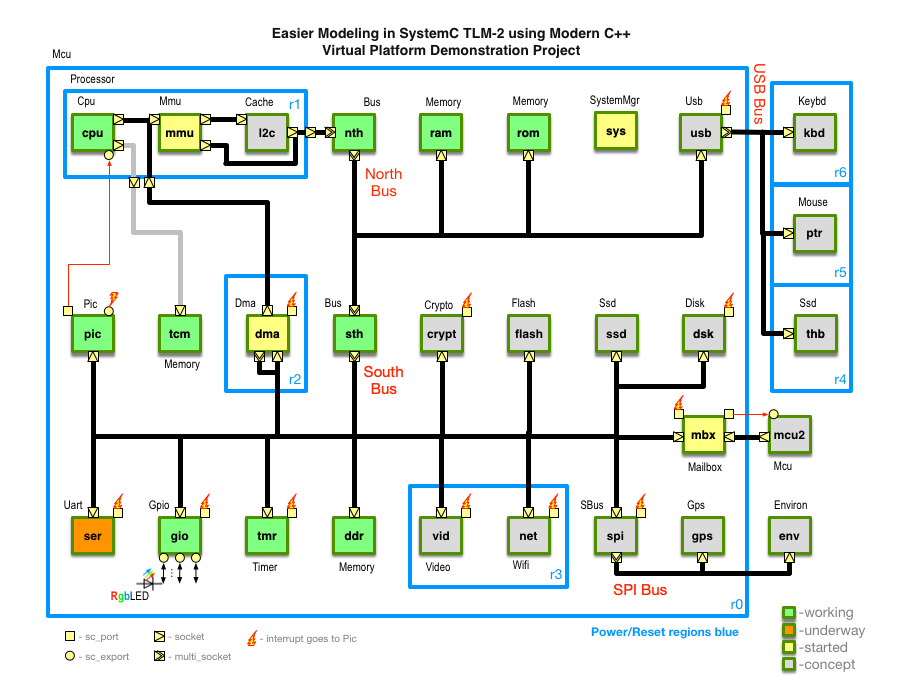

<!-- For doxygen -->
\mainpage

<a name="ToC"></a>

Table of Contents
-----------------

+ [About the Project](#AbtMe)
+ [The Grand Design](#GrandDesign)
  - [Block Diagram](#BlkDiag)
  - [Memory Map](#MemMap)
  - [Design Notes](#DNotes)
  - [Module Status](#Stats)
  - [To Do List, Wishlist](#ToDo) and [Issues](#IssuesNideas)
+ [Rules, Conventions, and Guidelines](#CRules)
+ [Instructions for Building](#HowTo)
+ [About **THIS document** and Markdown](#Mrkdown)

<br/>
__________________________________________________________________________________
<a name="AbtMe"></a>

Important notes
===============

Status
------

The current state of this project is Alpha! In other words, there are lots of potholes and several places I have intentions to do some rather major fixups. Notably, I will be refactoring the TLM-2.0 implementation to reflect a much simpler way of including bus interfacing for both the Initiator and Target. This project is being released now because it has been too long since I've updated it.

Contributing
------------

If you have an interest in actively contributing to this project, please contact me directly. There are plenty of modules that need to be developed. A primary and important aspect of this project is to maintain the 

About the Platform Project
==========================

[Back to Table of Contents](#ToC)

This directory contains a basic SystemC design using TLM-2.0 with a single top-level module and a practical main implementation that validates each step, and provides an execution summary including timing/performance information.  If errors are detected, main exists with a non-zero status.

This project has several goals:

1. Provide an example of a complete TLM-2 virtual platform for study using Modern C++.
2. Should be able to demonstrate Blinky and Hello-world tests.
3. Provide examples of different techniques of modeling.
  1. Loosely-timed and Approximately-timed models of initiators, interconnect and targets
  2. The absence of real clocks using the `no_clock` channel and the global distribution mechanism
  3. Resets and Power domain modeling
  4. Processor implementation with an ISS and support for interrupts
4. Provide the basis for "Easier SystemC" templates.
5. Several approaches to configuration

At any point in time, this project represents a set of ideas in the making, and not expected to be complete. Various authors may contribute to this effort, and as such, coding guidelines have bee provided here-in. It is important that this code be *model code* and meet high levels of documentation and formatting to make it easy to understand. Comment blocks are highly encouraged.

Definition: Modern C++ means use of features introduced in the C++ standards from 2011, 2014 and 2017. Of course, we do not mean to be completely indiscriminate in this. Features should be used when they provide some advantage. Any one of the following may be deemed an advantage.

1. Simplify the code and make it easier to understand
2. Provide coding safety against mistakes
3. Improve performance or functionality

Of course there may occasionally be some disagreement in which case there should proceed some discussion and perhaps even more comments in the code to help the reader.

<br/>
__________________________________________________________________________________
<a name="GrandDesign"></a>

# The Grand Design

<a name="BlkDiag"></a>

## Block Diagram

[Back to Table of Contents](#ToC)

- Names inside the boxes are instance names.
- Names outside the boxes are part of a module name.
- Blocks with an exclamation mark (`!`), either generate or receive interrupts.
- Dotted boxes indicate a power or reset domain



```
Top
+------------------------------------------------------------------+
|                                                                  |
|    SystemMgr            Mcu                                      |
|     +-----+             +-----+   +-----+                        |
|     | sys |             |mcu2 >---> mbx >------.                 |
|     +-----+             +-----+   +-----+      |                 |
| Mcu                                            |                 |
| +----------------------------------------------^---------------+ |
| |......................                        |             r0| |
| |:  Cpu   r1: Dma   r2: Pic       Gpio         |     Crypto    | |
| |:  +-----+ : +-----+ : +-----+   +-----+      |     +-----+   | |
| |:  ! cpu ! : | dma ! : ! pic !   | gio !      x----->crypt!   | |
| |:  +--v-v+ : +v-^-v+ : +--^--+   +--^--+      |     +-----+   | |
| |:     | |  :..|.|.|..:    |         |         |               | |
| |:     | |  :  | | |       |         |         |               | |
| |:     |<|-----' '-x-------x---------x---------x     SBus      | |
| |:     | |  :              |         |         |     +-----+   | |
| |:  Mmu| '------.          |         |         x-----> spi !   | |
| |:  +--v--+ :+--v--+    +--v--+   +--v--+      |     +--v--+   | |
| |:  ! mmu ! :| tcm |    | ssd |   |flash|      |        |      | |
| |:  +v---v+ :+-----+    +-----+   +-----+     S|   .----'      | |
| |:  P|  S|  :Memory     Ssd       Flash       o|   | Environ   | |
| |:   |   |  :                                 u|   | +-----+   | |
| |:.--'   |  ...............................   t|   x-> env |   | |
| |:| Cache|  : Ssd   r4: Mouse r5: Keybd r6:   h|   | +-----+   | |
| |:| +----v+ : +-----+ : +-----+ : +-----+ :    |   |           | |
| |:| | l2c | : | thb | : | ptr | : | kbd | :   B|   | +-----+   | |
| |:| +--v--+ : +--^--+ : +--^--+ : +--^--+ :   u|   '-> gps |   | |
| |:|    |    :....|....:....|....:....|....:   s|     +-----+   | |
| |:'--->|    :    '---------x---------'         |     Gps       | |
| |:.....|....:              |                   |               | |
| |   Bus|      Disk      Usb|      Bus          |     Memory    | |
| |   +--V--+   +-----+   +--^--+   +-----+      |     +-----+   | |
| |   | nth |   | dsk !   | usb !   | sth >------x-----> ddr |   | |
| |   +--V--+   +--^--+   +--^--+   +--^--+      |     +-----+   | |
| |      |         |         |         |         |               | |
| |      x---------x---------x---------x         x--------.      | |
| |      |         |         |         |         |        |      | |
| |      |         |    .....|.........|.....    |        |      | |
| |      |         |    :    |         |  r3:    |        |      | |
| |   +--v--+   +--v--+ : +--v--+   +--v--+ : +--v--+  +--v--+   | |
| |   | ram |   | rom | : | net !   | vid ! : | tmr !  | ser !   | |
| |   +-----+   +-----+ : +-----+   +-----+ : +-----+  +-----+   | |
| |   Memory    Memory  : Wifi      Video   : Timer    Uart      | |
| |                     :...................:                    | |
| |                                                              | |
| +--------------------------------------------------------------+ |
+------------------------------------------------------------------+

```

<br/>
__________________________________________________________________________________
<a name="MemMap"></a>

Memory Map
----------------------------------

[Back to Table of Contents](#ToC)

| Block | Base Address | Bus | Size | Irq | Module     |
| ----- | -----------: | --- | ---: | --: | :-----     |
| cpu   | 0xF000'0000  |  -  |  128 |  -  | Cpu        |
| rom   | 0x0000'0000  | NTH |  96M |  -  | Memory     |
| ram   | 0x1000'0000  | NTH | 128K |  -  | Memory     |
| ddr   | 0x2000'0000  | NTH | 256M |  -  | Memory     |
| tmr   | 0x4000'0000  | sth |   32 |  2  | Timer      |
| gio   | 0x4000'1000  | sth |   32 |  3  | Gpio       |
| crypt | 0x4000'2000  | sth |   2K |  4  | Crypto     |
| pic   | 0x4000'3000  | sth |   1K |  5  | IrqCtrl    |
| dma   | 0x4000'4000  | sth |   32 |  1  | Dma        |
| flash | 0x4000'5000  | sth |   4K | 13  | Flash      |
| spi   | 0x4000'6000  | sth |   32 |  6  | SBus       |
| ser   | 0x4000'7000  | sth |   32 |  7  | Uart       |
| mbx   | 0x4000'7000  | sth |   32 | 14  | Mailbox    |
| dsk   | 0x4008'0000  | NTH |   1K |  8  | DiskC      |
| net   | 0x4008'1000  | NTH |   32 |  9  | Wifi       |
| mmu   | 0x4008'2000  | NTH |   32 | 10  | Mmu        |
| usb   | 0x4008'3000  | NTH |   32 | 11  | Usb        |
| ssd   | 0x6000'0000  | sth |   2M | 14  | Ssd        |
| flash | 0x8000'0000  | sth |   1G |  8  | Flash      |
| vid   | 0xC000'0000  | NTH |  16M | 12  | Video      |
| gps   | spi:0x0      | spi |   32 |  -  | Gps        |
| env   | spi:0x100    | spi |   32 |  -  | Environ    |
| ptr   | usb:0        | usb |   32 |  -  | Mouse      |
| kbd   | usb:1        | usb |   32 |  -  | Keyboard   |
| thb   | usb:2        | usb |  32G |  -  | Ssd        |
| nth   | 0x0000'0000  |  -  |   4G |  -  | Bus        |
| sth   | 0x4000'0000  |  -  |  64K |  -  | Bus        |
| l2c   | n/a          |  -  |    - |  -  | Cache      |
| prc   | n/a          |  -  |    - |  -  | Proc       |
| mcu1  | n/a          |  -  |    - |  -  | Mcu        |
| mcu2  | n/a          |  -  |    - |  -  | Mcu        |
| sys   | n/a          |  -  |    - |  -  | SystemMgr  |

<br/>
__________________________________________________________________________________
<a name="DNotes"></a>

Design Notes
------------

[Back to Table of Contents](#ToC)

- Main buses are designated as North (nth), and South (sth)
- North bus is closest to the "main" processor (cpu)
- System clock 400MHz
- Processor is RISC (cm0+ or possibly w/ FPU e.g. Arm cm4f)
- Cpu tasks provide initiator behaviors (e.g. memory test, processor emulation)
- NTH is 32 bits 100MHz
- STH is 16 bits  50MHz
- rom is a type flash (fast write)
- flash is paged slower flash with separate controls
- Gpio has 64 pins and can additionally be stimulated or record from/to files
- Terminal communicates via TCP sockets
- Video reads/writes files
- Wifi sends/receives from web
- Timer is expandable (1-16)
- Memory has read-only option & supports DMI
- Mmu has zero latency
- `DiskCtrl` reads/writes real files
- `Dma` has configurable # channels (1-16)
- `Pic` accepts N sources, simple priority interrupt controller
- Serial I/O configurable baud
- Eventually Video or Wifi may become a hierarchical sub-system
- Eventually one of the buses will become customized
- Order of development is TBD, but simplest first
- Four power regions labeled r0 through r6
- One hierarchical boundary in the `Proc_module` represented by r1
- SystemManager manages clocks/power/resets

<br/>
__________________________________________________________________________________
<a name="Stats"></a>

Module Status
-------------

[Back to Table of Contents](#ToC)

Each module will its status noted here. The following states are allowed:

- Thought - placeholder from this document not yet tackled
- Concept - documentation has begun
- Started - initial coding (some files in various states)
- Basic - basic functionality achieved with minimal coding
- Tested - extensive testing completed

| Class or Module     | Short Description                            | About | State   |
| :------------------ | :------------------------------------------- | :---: | :------ |
| `Bus_module`        | Interconnect                                 |   Y   | Basic   |
| `Cpu_module`        | Initiator                                    |   Y   | Basic   |
| `Memory_module`     | Target RAM                                   |   Y   | Basic   |
| `Timer_module`      | Target timer                                 |   Y   | Basic   |
| `no_clock`          | Substitute clock                             |   Y   | Basic   |
| `Mailbox_module`    | Hardware communication between processors    |   Y   | Concept |
| `Excl_filter`       | Implements non-locking bus mutual exclusion. |   Y   | Started |
| `Excl_extn`         | Request mutual exclusion.                    |   Y   | Started |
| `Dma_module`        | Target/Initiator                             |   Y   | Concept |
| `Pic_module`        | Priority Interrupt Controller                |   Y   | Started |
| `Power` class       | Model power regions                          |   Y   | Started |
| `Reset` class       | Model resets                                 |   Y   | Concept |
| `Report` routines   | Simplify reporting                           |   Y   | Basic   |
| `Secure_extn`       | Identify transactions to secure areas.       |   Y   | Started |
| `Task_manager`      | Access tasks by name                         |   Y   | Concept |
| `Wallclock`         | Platform independent timing                  |   Y   | Concept |
| `Cache_module`      | Implement an associative cache               |   Y   | Concept |
| `Cache_extn`        | Used to perform cache actions                |   Y   | Started |
| `Mmu_module`        | MMU/MPU implementation                       |   Y   | Started |
| `Config_extn`       | Used to interrogate instances                |   Y   | Basic   |
| `armv6m` task       | Cpu task to emulate Arm Cortex-M0+ ISS       |   Y   | Started |
| `memory_test`       | Cpu task to test memory block                |   Y   | Basic   |
| `timer_test`        | Cpu task to test timer  block                |   Y   | Basic   |
| `Timer` behavior    | Behavior of timer used by `Timer_module`     |   Y   | Basic   |
| `Timer_api`         | API used `Timer_test`                        |   Y   | Basic   |
| `hexfile` utils     | Save/load/dump hex data                      |   Y   | Basic   |
| `Signal` class      | Specify how to handle CTRL-C                 |   Y   | Basic   |
| `Interrupt_channel` | Carry interrupts between modules             |   Y   | Basic   |
| `Summary` class     | Summarize execution                          |  TBS  | Concept |
| `Netlist` class     | Dump netlist into output                     |  TBS  | Basic   |
| `sc_main`           | Beyond basics.                               |  TBS  | Concept |
| `Top_module`        | Module connectivity                          |  TBS  | Basic   |
| `Proc_module`       | Hierarchical TLM                             |  TBS  | Thought |
| `Disk_module`       | Disk simulation using file system            |  TBS  | Thought |
| `SBus_module`       | Serial interconnect (SPI or I2C)             |  TBS  | Thought |
| `Crypto_module`     | Cryptography unit                            |  TBS  | Thought |
| `Gpio_module`       | General purpose I/O                          |   Y   | Basic   |
| `Gpio_extn`         | GPIO extension to read/write from/to files   |   Y   | Started |
| `Ssd_module`        | Solid state memory (possibly sophisticated)  |  TBS  | Thought |
| `Flash_module`      | Flash memory unit (various types modeled)    |  TBS  | Thought |
| `Environ_module`    | Environment sensors (temp, magnetic, ...)    |  TBS  | Thought |
| `Usb_module`        | USB interconnect                             |  TBS  | Thought |
| `Video_module`      | Video display (possibly GPU too)             |  TBS  | Thought |
| `Uart_module`       | Serial port                                  |  TBS  | Started |
| `Gps_module`        | GPS location                                 |  TBS  | Thought |
| `Wifi_module`       | WiFi using network to simulate               |  TBS  | Thought |
| `Proc_module`       | Simple hierarchical wrapper                  |  TBS  | Thought |
| `Mcu_module`        | Simple hierarchical wrapper                  |  TBS  | Thought |
| `Mailbox_module`    | Mailbox for heterogenous interconnect        |  TBS  | Thought |
| `SystemMgr_module`  | System manager for clocks/power/resets       |  TBS  | Thought |
| `News`              | report handler extensions                    |  TBS  | Started |
| `RgbLED_module`     | Simulate a single RGB LED. Not TLM-2         |   N   | Basic   |
| `Fanout`            | Expands from `sc_bv[N]` to `sc_bit[N]`       |  TBS  | Basic   |
| {:TBS:}             | {:TBS:}                                      |  TBS  | {:TBS:} |

<br/>
__________________________________________________________________________________
<a name="ToDo"></a>

To Do List
----------

[Back to Table of Contents](#ToC)

In order of priority:

  1. Abstract TLM connetivity into protocol specific submodules with simpler API
       1. Base_protocol
       2. APB_protocol
       3. AXI_protocol
  2. Finish `pic_api.h` and add `pic_test.cpp`.
  3. Add `gpio_api.h` and add `gpio_test.cpp`.
  4. Finish `Uart_module`
  5. Add `Dma_module`
  6. Add `dma_api.h` and `dma_test.cpp`
  7. Add power-down capability (?use CCI?) with reset
  8. Add timing to AT mode of `Bus_module` with analysis port support
  9. Implement filter interconnect
  10. Implement a CPU emulation (e.g. armv6m or Mini32)
 11. Modify configuration to support CCI parameters
 12. Update licensing/copyright info (Doulos Inc.)
 13. Update doxygen
 14. Add static checking (?cccc)

### Optional

1. Add fancy report handler with XML option and expectations for error injection
2. Consider refactor `Cpu_module` to use PIMPL and separate API and tests.
3. Consider refactor `Memory_module` to use PIMPL
4. Add a shell interface and a scripting language for use in a CPU thread. LUA, Python or TCL.
5. Add a `Stack_module` (LIFO).
6. Add `Global` class to replace `g_` variables and provide better control/observation. Or use CCI.
7. `Apb2tlm_adapter` and `Tlm2apb_adapter`
8. `Axi2tlm_adapter` and `Tlm2axi_adapter`

<a name="IssuesNideas"></a>

Issues and ideas
----------------

Add liberally here if you have contribution permissions; otherwise, use GitHub issues.

- More collaborators might be good
- Testing needs to go deeper
- Stronger emphasis on the &lt;AS-IS&gt; state of the project.

### See Also

- Related project <https://github.com/dcblack/sc-templates>

<br/>
__________________________________________________________________________________
<a name="CRules"></a>

Rules, Conventions, and Guidelines
------------------------------------

[Back to Table of Contents](#ToC)

- Documentation will be maintained in GitHub style Markdown
   + ABOUT_{:NAME:}.md will document each module
- C++14 standard will be the minimum C++ standard level used.
- Header filenames have suffix `.hpp` unless purely C11 compatible.
- Compiled C++ filenames have suffix `.cpp` unless purely C11 compatible.
- Raw pointers and arrays will be avoided. Instead use `std::unique_ptr<>`, `std::shared_ptr<>`, `std::vector<>`, etc. when possible. References are better than pointers of any type.
- `cstdint` will be preferred over built-in types.
- Destructors will be defined. `default` is allowed if no allocations need to be managed.
- TLM Base Protocol will be preferred.
- Ignorable extensions will be preferred.
- Underscores will be used to separate words.
- User-defined types (e.g. classes, structs, enums) will start.  with use Name case.
- `enum class` will be preferred over simple `enum`
- Methods and variables will be lowercase.
- UPPERCASE may be used for labels, enumeration values and constants only.
- `and` will be preferred over `&&`.
- `or` will be preferred over `||`.
- `not` will be preferred over `!`.
- Leading or trailing underscores `\_` will NEVER be used together (i.e. `a_`
  and `_a` are legal, but `_a_` is not).

| Pre/Suf    | Use                             |
| ---------- | ------------------------------- |
| `_api`     | initiator methods/constants     |
| `_beh`     | behavioral implementation       |
| `_delay`   | relative simulation `sc_time`   |
| `_channel` | channel (usually primitive)     |
| `_extn`    | `tlm_extension`                 |
| `_if`      | interface class for channels    |
| `_method`  | `SC_METHOD`                     |
| `_module`  | `sc_module`                     |
| `_port`    | `sc_port`                       |
| `_rtl`     | RTL implementation              |
| `_socket`  | TLM socket                      |
| `_t`       | `typedef`                       |
| `_thread`  | `SC_THREAD`                     |
| `_time`    | absolute simulation `sc_time`   |
| `_xport`   | `sc_export`                     |
| `g_`       | global variables                |
| `get_`     | const accessor method           |
| `is_`      | returns bool status             |
| `m_`       | class member attributes         |
| `_ptr`     | pointer to object               |
| `s_`       | class static attributes         |
| `set_`     | modifying accessor method       |

## Extras

Numerous extras have been added including:

- `report.h` is provided to simplify message reporting. See `report.h` comments for more information.
- `configuration.h` and `config/configuration.cpp` provide a generalized configuration mechanism that used to configure memory maps and other features.
- `proxy.h` and `proxy.cpp` supply a proxy for modules that do not have `Configuration` built in.

<br/>
__________________________________________________________________________________
<a name="HowTo"></a>

Instructions for Building
---------------------------------------------

[Back to Table of Contents](#ToC)

Dependencies
------------

+ Cmake is used to configure.
+ SystemC version 2.3.2 or better
+ C++14 or better
+ Boost libraries

If you would like to contribute, you should also have:

+ git
+ astyle

### Linux/OSX

1. Open a terminal and navigate into the `build/` directory located where this file is located.
2. Configure by typing `cmake ..`
3. Build code with `make` or `make all`
4. Alternately, build and run with `make run`
5. To pass arguments to run, use `env ARGS="-your args" make run`
6. To cleanup after running, use `make clean`
A slightly more automated approach uses some scripts located in the `bin/` directory.  A `setup.profile` bash script should be sourced to set environment variables; however, it will need some tweaking. For one thing, it uses [`modulecmd`](https://modules.readthedocs.io/en/latest/module.html) to setup C++ (clang), SystemC and Boost environment.

### Windows

*To be determined*

<br/>
__________________________________________________________________________________
<a name="Mrkdown"></a>

About Markdown
--------------

[Back to Table of Contents](#ToC)

This document is maintained with the rest of the project on GitHub at <https://github.com/dcblack/sc-platform>.

Tip: If you are reading this document in VIM (or any variant) text, you will notice unique labels in this document. For instance, this section starts an HTML anchor with an attribute value inside double quotes. If you are in Vim (vi or gvim too), you can place the cursor on the word and press asterisk `*`, which will take you to the table of contents.  Another press will bring you back. So you can quickly navigate anywhere from the table of contents! :-)

This document was created as a MarkDown text file.

- Best viewed with a Markdown rendering tool (e.g. [Typora](https://www.typora.io), [ReText](https://www.fossmint.com/retext-a-powerful-text-editor-for-markdown-and-restructuredtext/) or [Atom](https://www.atom.io)).
- Or generate HTML, PDF or DOC using pandoc <http://pandoc.org/installing.html>
- Do not edit derived files
- For apps that view/edit markdown see <https://github.com/karthik/markdown_science/wiki/Tools-to-support-your-markdown-authoring>.
- Same syntax as used for GitHub README's etc. Very popular among programmers.

Reasons for GitHub Markdown include:

- Very simple - relatively intuitive and easy to learn
- No special tools - works for any text editor across platforms (Linux, Windows, Mac, iPhone)
- Supports code syntax highlighting
- Easy to integrate into web-pages
- Easy to convert to Word, PDF, Pod, Tex, HTML
- Wide spread support in the programming community
- Small files
- VERY portable

<br/>
__________________________________________________________________________________

### The end
